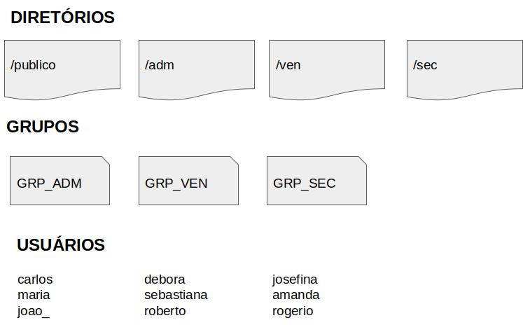

# 📐 Desafio de Projeto 🚀

#### Infraestrutura como código: Script de criação de estrutura de usuários, diretórios e permissões com Linux 🐧

## O que é? 🤔💭

Infraestrutura como código (IaC) é o gerenciamento e provisionamento da infraestrutura por meio de códigos, em vez de processos manuais.

Com a IaC, são criados arquivos de configuração que incluem as especificações da sua infraestrutura, facilitando a edição e a distribuição de configurações. Ela também assegura o provisionamento do mesmo ambiente todas as vezes.
###### Fonte: Red Hat - https://www.redhat.com/

## Controle de versão 🧮

O controle de versão é uma parte importante da IaC. Os arquivos de configuração devem pertencer à fonte como qualquer outro código-fonte de software. Ao implantar a infraestrutura como código, também é possível separá-la em módulos, que podem ser combinados de diferentes maneiras por meio da automação.

## Principal benefício 👨‍💻
Ao automatizar o provisionamento da infraestrutura com a IaC, os desenvolvedores não precisam provisionar e gerenciar manualmente servidores, **sistemas operacionais**, **armazenamento** e outros componentes de infraestrutura sempre que criam ou implantam uma aplicação.

## Definições 📖

- Todo provisionamento deve ser feito em um arquivo do tipo Bash Script;
O dono de todos os diretórios criados será o usuário root;
- Todos os usuários terão permissão total dentro do diretório */publico*;
- Os usuários de cada grupo terão permissão total dentro de seu respectivo diretório;
- Os usuários não poderão ter permissão de *__leitura__*, *__escrita__* e *__execução__* em diretórios de departamentos que eles não pertencem;
- Subir arquivo de script criado para a sua conta no GitHub.

## 🤖 Estrutura:

</img>

🔗 [Veja o Código.](https://github.com/lucaspaulo2017/linux-projeto1-iac/blob/main/iac1.sh)

---

🚧 Projeto da [Dio.me](https://web.dio.me) do curso:

Formação Linux Fundamentals</img> 

